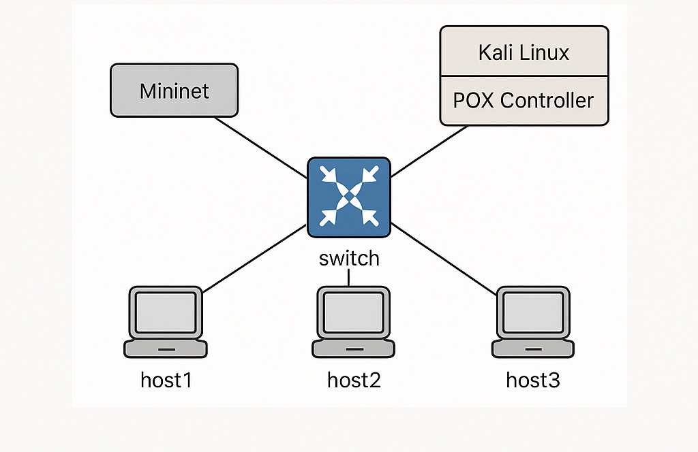

# SDN Dataset Development – Phase 1

**Author:** Bhavesh (student)  
**Date:** 2025-09-10  

## Overview

This repository contains the initial SDN dataset developed for security research. Phase 1 includes:

- SDN testbed setup (Mininet + POX + Kali Linux)
- Benign traffic captures
- Attack traffic captures (ARP spoof, SYN flood, Port scan)
- Dataset structure for analysis

## Topology



**Topology Description:** Single switch connected to 3 hosts.  
- H1, H2, H3 connected to a single OpenFlow switch
- POX controller running on Kali VM
- Attacks simulated from Kali VM

```bash
sudo mn --topo single,3
Virtual Machine Setup
VM	Memory	CPU	Disk	OS
Kali	8 GB	4	80GB	Kali Linux 2024.4
Ubuntu	4 GB	8	20GB	Ubuntu 20.x
Dataset Structure
sdndata/
├── pcaps/
│   ├── benign/                 # ICMP and other benign traffic
│   └── attacks/
│       ├── arp_spoof/          # ARP spoof traffic
│       ├── syn_flood/          # SYN flood traffic
│       └── port_scan/          # Port scan traffic
└── analysis/                   # Analysis outputs (optional)
scripts/
├── capture_benign.sh           # Script to capture benign traffic
└── capture_attacks.sh          # Script to capture attacks
topology_diagram.png             # SDN topology diagram

How to Use
Capture Benign Traffic
# On Mininet host H2
tcpdump -i h2-eth0 -w ~/sdndata/pcaps/benign/icmp_ping.pcap &

Capture Attack Traffic
# On Mininet host H2
tcpdump -i h2-eth0 -w ~/sdndata/pcaps/attacks/arp_spoof/arp_attack.pcap &
tcpdump -i h2-eth0 -w ~/sdndata/pcaps/attacks/syn_flood/syn_flood.pcap &
tcpdump -i h2-eth0 -w ~/sdndata/pcaps/attacks/port_scan/port_scan.pcap &

Notes

All captures performed in a safe, isolated lab environment.

Dataset intended for educational and research purposes only.

Ensure correct permissions to run tcpdump and Mininet commands.


---

This `README.md` explains:

1. **Project purpose**  
2. **Topology diagram**  
3. **VM setup**  
4. **Folder structure**  
5. **How to use capture scripts**  
6. **Safety notes**  

---